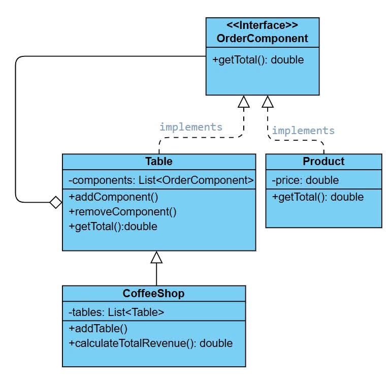
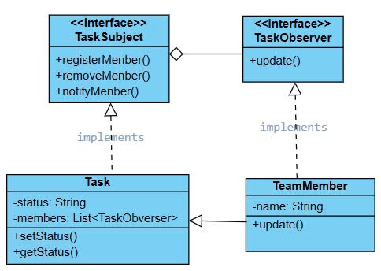
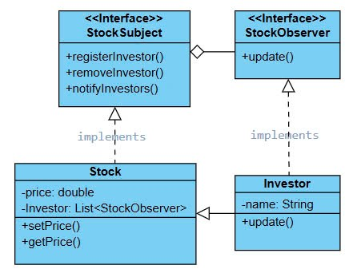

# Composite Design Pattern
- Sơ đồ quán cà phê: Tính tổng doanh thu dựa trên các sản phẩm (Product) và bàn (Table) sử dụng Composite Pattern.

## Observer Design Pattern
- **Sơ đồ Trường hợp Task**: Khi trạng thái công việc thay đổi, thành viên nhóm nhận thông báo tự động.

- **Sơ đồ trường hợp Cổ phiếu**: Khi giá cổ phiếu thay đổi, các nhà đầu tư đăng ký nhận thông báo ngay lập tức.

